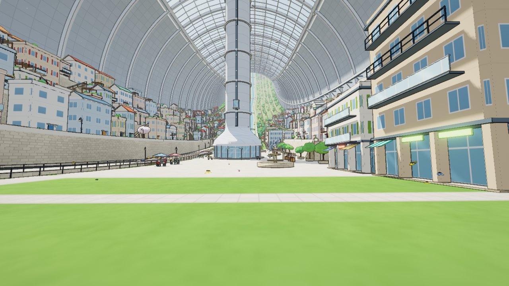
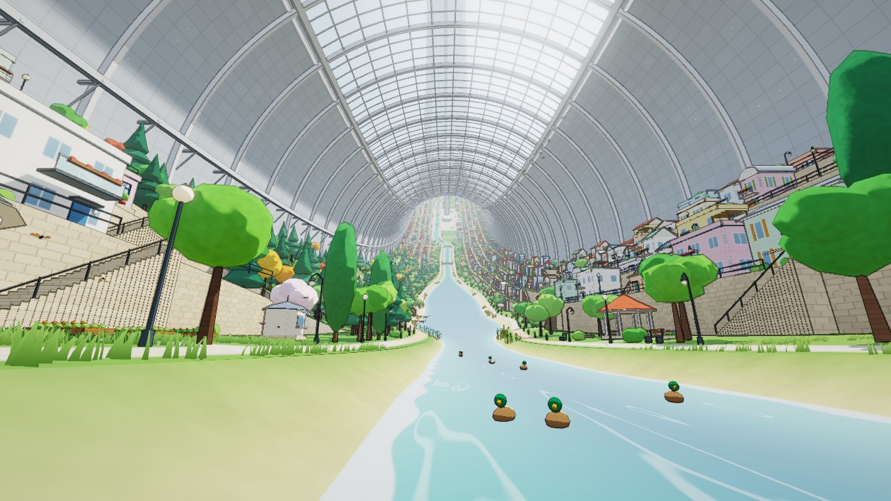

# Stanford Torus

A first-person walking simulator set inside a Stanford torus space habitat, running in the browser.
The world is drawn in a cel-shaded, ink-outlined style and almost everything in it is generated
procedurally: the valley and its terraces, the river and lakes, towns, houses, farms, rice paddies,
forests, bridges, stairways, street furniture, the habitat shell, the monorail, and the view of the
hub, spokes and far side of the ring through the skylight. There are no people — just birds, ducks,
butterflies, fireflies and trains.





## Running it

```sh
npm install
npm run dev       # development server at http://localhost:5173
npm run build     # static production build in dist/
npm run preview   # serve the production build
```

The build is a static site (`dist/`) and can be hosted anywhere. It needs a browser with WebGL 2.

### Controls

| Input | Action |
| --- | --- |
| `W` `A` `S` `D` / arrows | walk |
| mouse | look (click *Enter the ring* to capture the pointer; drag-to-look is the fallback) |
| `Shift` | run |
| `Space` | jump (or rise, when flying) |
| `F` | toggle flying; `C` sinks while flying |
| `[` / `]` | time of day −/+ 1 hour |
| `T` | pause / resume the day cycle |
| `M` | mute |
| `H` | hide the HUD |
| `Esc` | menu (quality, field of view, day length, invert Y) |

On touch screens the left half of the screen is a movement stick and the right half looks around.

URL parameters are handy for exploring: `?s=<arc metres>&u=<lateral metres>&yaw=<rad>&pitch=<rad>&t=<hour>&q=low|medium|high`.
For example `?s=2250&u=-10&t=18` starts in the woods at dusk.

## The habitat

The dimensions follow the 1975 design study: a ring 1.8 km across whose 130 m-diameter tube spins
once a minute, giving about 1 g at the floor. Walking, you can see the land curve up ahead and behind
you until it disappears behind the ceiling roughly 50° around the ring. Gravity is modelled as the
centrifugal pull in the rotating frame, and jumps feel a (small) Coriolis drift.

Six spokes divide the ring into six stretches, each with its own character:

| Stretch | Character |
| --- | --- |
| Lakeside | a wide lake with beaches, boathouses and willows; forest on one bank |
| Farms | terraced crop fields, greenhouses, barns, orchards and hay |
| Woods | natural wooded slopes with conifers, autumn colour and rocks |
| Rice Terraces | flooded paddy terraces, cherry trees, bamboo, stone lanterns and a tea house |
| Water Gardens | a second lake with garden terraces |
| Meadows | wildflower meadows and orchard terraces |

Around each spoke is a town: a paved plaza with the elevator tower that climbs to the ceiling,
fountains, a market, cafés and mid-rise buildings, with the river pushed into a stone canal.
Between towns are residential terraces of procedurally built houses (pitched, flat, barrel and shed
roofs; balconies, awnings, shutters, roof gardens). Place names are generated too.

Daylight is sunlight brought in by mirrors; the mirror array is steered through the day so the light
rakes in low and warm in the morning and evening, and shuttered at night — when the skylight shows
the stars wheeling past once a minute, the hub, the spokes and the lit windows of the far side of the
ring, and the town lights come on.

## How it works

| Area | Files |
| --- | --- |
| Coordinates & noise | `src/core/` — ring coordinates `(s, u, h)`, seeded hashes and ring-periodic noise |
| Large-scale layout | `src/world/layout.js` — districts, river, and the terrace cross-section profile |
| Per-cell planning | `src/world/plan.js` — houses, stairs, bridges, lamps, props and paths per 11.5 m cell |
| Sector generation | `src/world/sector.js` — terrain, water, buildings, vegetation, shell and colliders per 57.6 m sector |
| Streaming | `src/world/manager.js` — loads ~±60° of ring around the player over several frames, swaps foliage LOD |
| Geometry | `src/geom/` — a small mesh builder plus procedural houses, trees, props and structures |
| Rendering | `src/render/` — toon shaders, shadow map, sky and exterior, post-processing |
| Player | `src/player.js`, `src/world/physics.js`, `src/input.js` |
| Animation & sound | `src/life/`, `src/audio.js` |

A few details worth knowing:

- **Deterministic, streamable world.** Everything is a pure function of position (hashes of cell
  indices and noise that is periodic around the ring), so any sector can be generated independently,
  in any order, and always comes out the same. Generation is written as JavaScript generators and
  spread across frames.
- **Cross-section profile.** The land is a fixed-topology profile (river bed, banks, valley, four
  terraces with vertical retaining walls, berm) swept around the ring. Terraces blend smoothly into
  natural slopes where a stretch calls for it, and paths are stored as signed-distance values per
  vertex so their edges stay crisp at any mesh resolution.
- **Cel shading.** All materials are custom GLSL 3 shaders with banded lighting, a hemisphere ambient,
  rim light, and patterns painted in the fragment shader (stone, windows, roof tiles, planks, shell
  panels, crop rows, paving). The light direction is computed per fragment because "down" changes
  around the ring.
- **Ink.** The scene renders to two MSAA targets — colour and normals — and a post pass draws
  outlines from depth discontinuities (the Laplacian of inverse depth, so flat ground never outlines
  itself) and normal creases, fading them with distance. Bloom and ACES tone mapping finish the image.
- **Shadows.** A single texel-snapped orthographic shadow map follows the player, oriented to the
  local light direction.

## Quality

The *Quality* menu trades render resolution, MSAA, shadow resolution, streaming distance and grass
density. The renderer also lowers its resolution automatically if the frame rate drops.

## License

MIT
